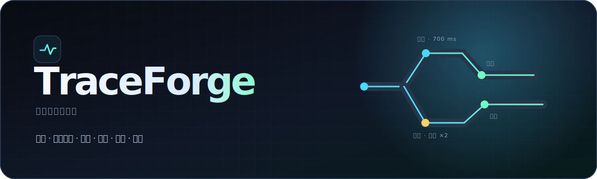
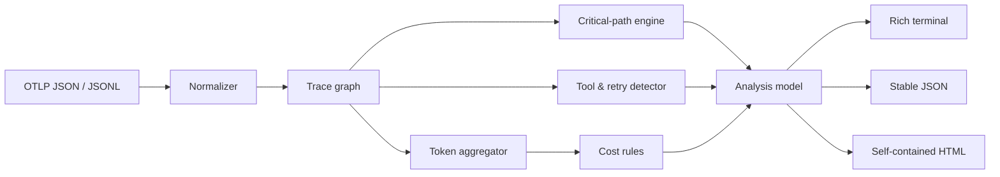

<p align="center">
  
</p>

<p align="center">
  <a href="https://github.com/abc123dx/traceforge-otel/actions/workflows/ci.yml"></a>
  <a href="https://www.python.org/"></a>
  <a href="LICENSE"></a>
  
  
</p>

<p align="center">
  <strong>See where your AI agent spent time, tokens, retries, and money — from a trace file.</strong>
</p>

TraceForge is a local-first CLI that turns OpenTelemetry traces into practical AI-agent
diagnostics. Give it an OTLP/HTTP JSON export or newline-delimited spans; get a focused Rich
terminal view, machine-readable JSON, or a polished standalone HTML report.

No backend. No account. No telemetry upload.

```console
$ traceforge demo
╭──────────────────────────────────────────────────────────────╮
│ TraceForge  agent trace intelligence                         │
╰──────────────────────────────────────────────────────────────╯
 Traces       1                 Spans              6
 Tool calls   3                 Tool errors        1
 Tokens       2,370 in / 460 out Estimated cost    $0.0052625
 Retry loops  1                 Source             built-in demo

Critical path  7f3a2c0917b3…  travel-assistant.run → plan itinerary
  ✗ get_weather (TimeoutError, 300.0 ms): Weather provider exceeded the deadline
  ↻ tool:get_weather 2 attempts, 300.0 ms before final attempt (recovered)
```

## Why TraceForge

General trace viewers show spans. TraceForge answers the questions that slow down agent teams:

| Question | TraceForge signal |
|---|---|
| Why was this run slow? | End-to-end latency plus an exclusive-time critical path |
| Which integration is flaky? | Tool-call detection, error type/message, and failed duration |
| Is the agent spinning? | Inferred retry loops, outcome, attempts, and time wasted |
| Where did the context budget go? | Input/output tokens aggregated by trace and model |
| What did this run cost? | Versionable, user-supplied per-model pricing rules |
| Can I attach the result to an issue? | Portable JSON and one-file offline HTML reports |

## Quick start

TraceForge requires Python 3.11 or newer.

```bash
git clone https://github.com/abc123dx/traceforge-otel.git
cd traceforge-otel
python -m venv .venv
source .venv/bin/activate
python -m pip install -e .

traceforge demo
traceforge analyze examples/demo-agent.otlp.json
traceforge report examples/demo-agent.otlp.json --output report.html
```

Analyze JSONL and save the complete result:

```bash
traceforge analyze examples/support-agent.jsonl \
  --cost-model examples/cost-model.example.json \
  --output analysis.json
```

Create both portable formats:

```bash
traceforge report trace.otlp.json \
  --cost-model pricing.json \
  --output trace-report.html \
  --json-output trace-report.json
```

## Commands

| Command | Purpose |
|---|---|
| `traceforge analyze TRACE` | Print findings and optionally write JSON |
| `traceforge report TRACE` | Generate a self-contained offline HTML report |
| `traceforge demo` | Run a built-in trace containing a recovered tool timeout |

Run `traceforge COMMAND --help` for every option. Input format is inferred from the filename and
content, or can be forced with `--format otlp|json|jsonl`.

## Input compatibility

TraceForge accepts:

- OTLP/HTTP JSON with `resourceSpans → scopeSpans → spans`
- a JSON array of flattened spans
- a JSON object with a top-level `spans` array
- JSONL/NDJSON with one flattened or OTLP-wrapped span per line
- camelCase OTLP keys and common snake_case exporter keys
- integer nanosecond timestamps or ISO 8601 timestamps in flattened spans

It understands current and widely deployed GenAI semantic-convention attributes, including:

| Signal | Preferred attribute | Compatible aliases |
|---|---|---|
| Operation | `gen_ai.operation.name` | `otel.operation.name` |
| Model | `gen_ai.response.model` | `gen_ai.request.model`, `llm.model_name` |
| Input tokens | `gen_ai.usage.input_tokens` | `gen_ai.usage.prompt_tokens`, `llm.token_count.prompt` |
| Output tokens | `gen_ai.usage.output_tokens` | `gen_ai.usage.completion_tokens`, `llm.token_count.completion` |
| Tool | `gen_ai.tool.name` | `tool.name`, `tool_name` |
| Errors | OTel `status=ERROR` | `error.type`, exception attributes/events |

Unknown attributes are preserved by the normalized parser, making it straightforward to extend
the analysis without losing exporter-specific context.

## How it works



The critical-path engine computes each span's **exclusive time** by subtracting the union of its
direct children's covered intervals. It then selects the root-to-leaf causal chain with the
largest sum of exclusive work. This avoids double-counting nested spans while making the chosen
chain explainable.

Retry detection groups sibling operations by their parent and semantic signature. A group is
reported when an earlier attempt failed or retry metadata is explicit. The report labels whether
the final attempt recovered and counts the duration before that final attempt as wasted time.
It is intentionally a transparent heuristic, not a claim about framework internals.

## Bring your own pricing

Provider prices change. TraceForge deliberately does not ship a silently aging global price
table. Commit a dated pricing document alongside your service instead:

```json
{
  "name": "team-rates-2026-01",
  "currency": "USD",
  "models": {
    "provider/model-exact": {
      "input_per_1m": 1.25,
      "output_per_1m": 5.0
    },
    "provider/fast-*": {
      "input_per_1m": 0.20,
      "output_per_1m": 0.80
    },
    "*": {
      "input_per_1m": 1.00,
      "output_per_1m": 3.00
    }
  }
}
```

Resolution order is exact model, longest matching prefix ending in `*`, then the `*` fallback.
Models without a matching rule remain visibly unpriced; their tokens are never discarded.

> The included example values are synthetic documentation data, not vendor pricing advice.

## JSON output

The output starts with a schema version and separates global totals from trace-level detail:

```json
{
  "schema_version": "1.0",
  "source": "trace.otlp.json",
  "cost_model": "team-rates-2026-01",
  "summary": {
    "trace_count": 1,
    "span_count": 6,
    "tool_errors": 1,
    "retry_loops": 1,
    "total_tokens": 2830,
    "cost_usd": 0.0052625
  },
  "traces": []
}
```

Numbers in JSON remain numeric, so the result can feed CI policies, notebooks, or a dashboard.

## Use in CI

Generate a review artifact after an integration test exports a trace:

```yaml
- name: Analyze agent trace
  run: |
    traceforge report artifacts/agent-trace.json \
      --cost-model observability/pricing.json \
      --output artifacts/traceforge-report.html \
      --json-output artifacts/traceforge-report.json
```

TraceForge currently reports findings without failing builds. Policy gates over its stable JSON
are on the roadmap.

## 中文快速说明

TraceForge 是一个本地运行的 AI Agent 链路分析 CLI。它读取 OpenTelemetry 的 OTLP JSON
或 JSONL span，自动汇总端到端延迟、关键路径、工具调用失败、Token 使用、重试循环和按自定义
价格表估算的成本，并输出终端表格、JSON 或单文件 HTML 报告。所有原始 trace 都留在你的电脑上。

```bash
traceforge analyze examples/demo-agent.otlp.json
traceforge report examples/demo-agent.otlp.json -o report.html
```

## Development

```bash
python -m pip install -e ".[dev]"
ruff check .
ruff format --check .
mypy
pytest
```

The package uses a `src/` layout, strict mypy, Ruff, pytest, and a Python 3.11–3.13 CI matrix.
See [CONTRIBUTING.md](CONTRIBUTING.md) before opening a pull request.

## Roadmap

- Trace comparison and regression budgets
- Framework-aware loop classifiers
- Optional redaction rules for report fields
- Policy exits for latency, cost, and reliability thresholds
- Native OTLP protobuf ingestion

Security issues should follow [SECURITY.md](SECURITY.md). TraceForge is available under the
[MIT License](LICENSE).
