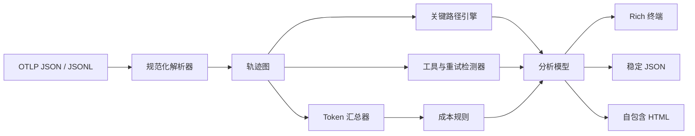

<p align="center">
  
</p>

<p align="center">
  
  <a href="https://www.python.org/"></a>
  <a href="LICENSE"></a>
  
  
</p>

<p align="center">
  <strong>只需一个轨迹文件，即可看清 AI Agent 的时间、Token、重试和成本都花在了哪里。</strong>
</p>

TraceForge 是一个本地优先的命令行工具，可将 OpenTelemetry 轨迹转化为实用的
AI Agent 诊断结果。输入 OTLP/HTTP JSON 导出或逐行 span 文件，即可得到聚焦的 Rich
终端视图、机器可读 JSON，或精美的单文件 HTML 报告。

无需后端，无需账号，不上传遥测数据。

```console
$ traceforge demo
╭──────────────────────────────────────────────────────────────╮
│ TraceForge  Agent 轨迹智能分析                               │
╰──────────────────────────────────────────────────────────────╯
轨迹       1                 Spans          6
工具调用   3                 工具错误       1
Token      2,370 输入 / 460 输出  估算成本  $0.0052625
重试循环   1                 来源           内置演示

关键路径  7f3a2c0917b3…  travel-assistant.run → 规划行程
  ✗ get_weather (TimeoutError, 300.0 ms)：天气服务超过 250 ms 截止时间
  ↻ tool:get_weather 共 2 次尝试，最终尝试前耗时 300.0 ms（已恢复）
```

## 为什么选择 TraceForge

通用轨迹查看器展示 span；TraceForge 则直接回答拖慢 Agent 团队的问题：

| 问题 | TraceForge 提供的信号 |
|---|---|
| 这次运行为什么慢？ | 端到端延迟，以及基于独占时间计算的关键路径 |
| 哪个集成不稳定？ | 工具调用识别、错误类型与消息、失败耗时 |
| Agent 是否陷入空转？ | 推断的重试循环、结果、尝试次数和无效耗时 |
| 上下文预算花在了哪里？ | 按轨迹和模型汇总的输入、输出 Token |
| 这次运行花了多少钱？ | 可版本化、由用户提供的模型价格规则 |
| 结果能否附到 issue 中？ | 可移植 JSON 和单文件离线 HTML 报告 |

## 快速开始

TraceForge 需要 Python 3.11 或更高版本。

```bash
git clone https://github.com/abc123dx/traceforge-otel.git
cd traceforge-otel
python -m venv .venv
source .venv/bin/activate
python -m pip install -e .

traceforge demo
traceforge analyze examples/demo-agent.otlp.json
traceforge report examples/demo-agent.otlp.json --output report.html
```

分析 JSONL，并保存完整结果：

```bash
traceforge analyze examples/support-agent.jsonl \
  --cost-model examples/cost-model.example.json \
  --output analysis.json
```

同时生成两种便携格式：

```bash
traceforge report trace.otlp.json \
  --cost-model pricing.json \
  --output trace-report.html \
  --json-output trace-report.json
```

## 命令

| 命令 | 用途 |
|---|---|
| `traceforge analyze TRACE` | 输出分析发现，并可选写入 JSON |
| `traceforge report TRACE` | 生成自包含的离线 HTML 报告 |
| `traceforge demo` | 运行一次包含工具超时后恢复的内置轨迹 |

运行 `traceforge COMMAND --help` 可查看每个选项。输入格式会根据文件名与内容自动推断，
也可通过 `--format otlp|json|jsonl` 强制指定。

## 输入兼容性

TraceForge 接受：

- 包含 `resourceSpans → scopeSpans → spans` 的 OTLP/HTTP JSON；
- 扁平 span 的 JSON 数组；
- 顶层含 `spans` 数组的 JSON 对象；
- 每行一个扁平或 OTLP 包装 span 的 JSONL/NDJSON；
- OTLP 驼峰键和常见导出器蛇形键；
- 扁平 span 中的整数纳秒时间戳或 ISO 8601 时间戳。

它识别当前及广泛部署的 GenAI 语义约定 attributes，包括：

| 信号 | 首选 attribute | 兼容别名 |
|---|---|---|
| 操作 | `gen_ai.operation.name` | `otel.operation.name` |
| 模型 | `gen_ai.response.model` | `gen_ai.request.model`、`llm.model_name` |
| 输入 Token | `gen_ai.usage.input_tokens` | `gen_ai.usage.prompt_tokens`、`llm.token_count.prompt` |
| 输出 Token | `gen_ai.usage.output_tokens` | `gen_ai.usage.completion_tokens`、`llm.token_count.completion` |
| 工具 | `gen_ai.tool.name` | `tool.name`、`tool_name` |
| 错误 | OTel `status=ERROR` | `error.type`、exception attributes/events |

规范化解析器会保留未知 attributes，便于扩展分析，同时不丢失导出器特有的上下文。

> 汉化只作用于文档和展示层。命令、flags、OTLP/OpenTelemetry 字段、span attribute 键、
> JSON schema/keys 与状态值保持不变，现有自动化无需迁移。

## 工作原理



关键路径引擎会从 span 的持续时间中减去直接子 span 覆盖区间的并集，计算每个 span 的
**独占时间**；随后选择独占工作总量最大的根到叶因果链。这样既不会重复计算嵌套 span，
又能清楚解释所选路径。

重试检测会按父节点和语义特征对同级操作分组。当早期尝试失败或存在显式重试元数据时，
该组会出现在报告中。报告会标记最后一次尝试是否恢复，并把最后一次尝试之前的耗时计为
无效耗时。这是一种透明、可解释的启发式规则，并不假定底层框架的内部实现。

## 使用自己的价格表

供应商价格会变化，因此 TraceForge 不内置会悄然过期的全局价格表。建议把带日期的价格
文档与服务代码一起版本化：

```json
{
  "name": "team-rates-2026-01",
  "currency": "USD",
  "models": {
    "provider/model-exact": {
      "input_per_1m": 1.25,
      "output_per_1m": 5.0
    },
    "provider/fast-*": {
      "input_per_1m": 0.20,
      "output_per_1m": 0.80
    },
    "*": {
      "input_per_1m": 1.00,
      "output_per_1m": 3.00
    }
  }
}
```

解析顺序依次为：精确模型、以 `*` 结尾的最长匹配前缀、`*` 兜底规则。没有匹配规则的
模型会明确标记为“未定价”，其 Token 仍会保留。

> 仓库中的示例价格仅为合成文档数据，不构成任何供应商价格建议。

## JSON 输出

输出以 schema 版本开头，并将全局总计与轨迹级详情分开：

```json
{
  "schema_version": "1.0",
  "source": "trace.otlp.json",
  "cost_model": "team-rates-2026-01",
  "summary": {
    "trace_count": 1,
    "span_count": 6,
    "tool_errors": 1,
    "retry_loops": 1,
    "total_tokens": 2830,
    "cost_usd": 0.0052625
  },
  "traces": []
}
```

JSON 中的数字始终保持数字类型，可直接用于 CI 策略、Notebook 或仪表盘。

## 在 CI 中使用

集成测试导出轨迹后，可以生成审查产物：

```yaml
- name: 分析 Agent 轨迹
  run: |
    traceforge report artifacts/agent-trace.json \
      --cost-model observability/pricing.json \
      --output artifacts/traceforge-report.html \
      --json-output artifacts/traceforge-report.json
```

TraceForge 当前只报告发现，不会使构建失败。基于稳定 JSON 的延迟、成本与可靠性策略门禁
已列入路线图。

## 开发

```bash
python -m pip install -e ".[dev]"
ruff check .
ruff format --check .
mypy
pytest
```

项目采用 `src/` 布局、strict mypy、Ruff 和 pytest，并支持 Python 3.11–3.13。
提交 Pull Request 前请先阅读 [CONTRIBUTING.md](CONTRIBUTING.md)。

## 路线图

- 轨迹对比与回归预算；
- 面向框架的循环分类器；
- 可选的报告字段脱敏规则；
- 针对延迟、成本和可靠性阈值的策略退出码；
- 原生 OTLP protobuf 输入。

安全问题请按 [SECURITY.md](SECURITY.md) 说明处理。TraceForge 基于
[MIT License](LICENSE) 开源。
